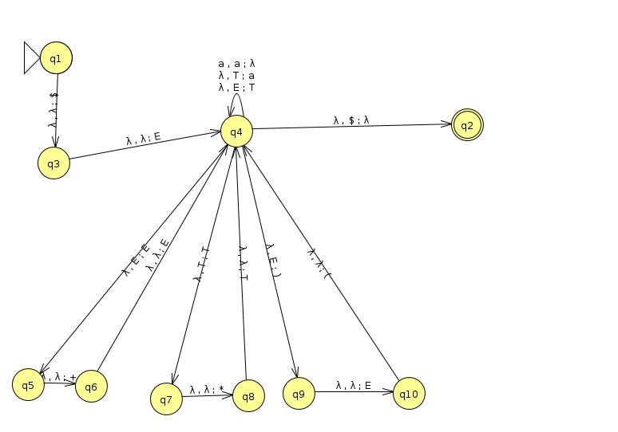

# FOCS Homework 10, for Day 11

```
Student Name: Keenan Zucker
Check one:
[X] I completed this assignment without assistance or external resources.
[ ] I completed this assignment with assistance from ___
   and/or using these external resources: ___
```

## I. Logic

### 1.

a. Construct the truth table for _a XOR (b XOR a)_.


_a_ | _b_ | _a_ XOR _b_ | _a XOR (b XOR a)_
----|-----|-----------  |--------------
 F  |  F  | F           | F
 F  |  T  | T           | T
 T  |  F  | T           | F
 T  |  T  | F           | T


b. Which function corresponds to the English word "or", as used in "You will eat your meat OR you can't have any pudding" (where _a_ = "You will eat your meat" and _b_ = "you can't have any pudding").

the 'XOR' function

## II. Questions 2–6 are the same as in-class activities 2-6

### 2.

Consider the following context-free grammar G:

```
E -> E + E | T         # <- added "| T"
T -> T x T | (E) | a
```

Convert G to a PDA.


### 3.

Convert grammar G from (2) to Chomsky Normal Form.

```
S -> E
E -> EB | EC | ED | a
T -> TD | TC | a
B -> PE
C -> LE
D -> ME | MT
P -> +
M -> x
L -> (
R -> )
```

### 4.

Is the grammar G's language a regular language? If yes, produce a FSA or regular expression for this language. If not, show this.

This language is NOT a regular language. We have learned previously that a normal FSA cannot check for the same number of parantheses on either side. Our CFG can essentially build out a bunch of parans using the rule T -> (E). This means we would have to use a PDA, as per problem #2, to account for those to be in the language.

### 5.

Theorem 1: The language {a^n b^n c^n} is not a context-free language.

a. Use Theorem 1, together with the languages {a^i b^i c^j} and {a^i b^j c^j}, to show that the set of context-free languages is not closed under intersection.

I don't know what 'closed under intersection means...'

b. Use the pumping lemma for context-free languages [Sipser pp. 125] to prove Theorem 1.

Start with string a10b10c10. Choosing almost any substring will prove that the string doesn't belong in the language. For example, if you chose the first 2 'a's and pumped them 4 times, then you would have a18b10c10, which no longer belongs in the language since the exponents are not equivelent. 

### 6.

Consider the context-free grammar G:

```
S -> NP VP
NP -> NP PP
NP -> DET N
VP -> V NP
VP -> VP PP
DET -> a | the
N -> boy | girl | flowers | binoculars
V -> touches | sees
PP -> P NP
P -> in | from | with
```

a. Show that the string "the girl touches the boy with the flower" has two
different leftmost derivations.

one:
S -> NP VP -> DET N VP -> the N VP -> the girl VP -> the girl V NP -> the girl touches NP -> the girl touches NP PP -> the girl touches DET N PP -> the girl touches the N PP -> the girl touches the boy PP -> the girl touches the boy P NP -> the girl touches the boy with NP -> the girl touches the boy with DET N -> the girl touches the boy with the N -> the girl touches the boy with the flower.

two:
S -> NP VP -> DET N VP -> the N VP -> the girl VP -> the girl VP PP -> the girl V NP PP -> the girl touches NP PP -> the girl touches DET N PP -> the girl touches the N PP -> the girl touches the boy PP -> the girl touches the boy P NP -> the girl touches the boy with NP -> the girl touches the boy with DET N -> the girl touches the boy with the N -> the girl touches the boy with the flower.

b. Describe in English the two different meanings of this sentence.

This sentence could have potentially two meanings. The first is that the girl is using a flower to touch the boy. The other is that the boy is in possession of the flower and the girl is simply touching him. It is unclear who is the owner of the flower.

c. Use G to generate another ambiguous sentence.

A boy sees the girl with the binoculars.

S -> NP VP -> DET N VP -> a N VP -> a boy VP -> a boy VP PP -> a boy V NP PP -> a boy sees NP PP -> a boy sees DET N PP -> a boy sees the N PP -> a boy sees the girl PP -> a boy sees the girl P NP -> a boy sees the girl with NP -> a boy sees the girl with DET N -> a boy sees the girl with the N -> a boy sees the girl with the binoculars.

d. Modify G so that it generates strings with adjectives: `the girl saw the tall boy`, `the girl touches the boy with a purple flower`.

```
S -> NP VP
NP -> NP PP
NP -> DET N
VP -> V NP
VP -> VP PP
DET -> DET A
DET -> a | the
A -> tall | purple
N -> boy | girl | flowers | binoculars
V -> touches | sees
PP -> P NP
P -> in | from | with
```
Generation of the sentence:
S -> NP VP -> DET N VP -> the N VP -> the girl VP -> the girl V NP -> the girl saw NP -> the girl saw DET N -> the girl saw DET A N -> the girl saw the A N -> the girl saw the tall N -> the girl saw the tall boy.