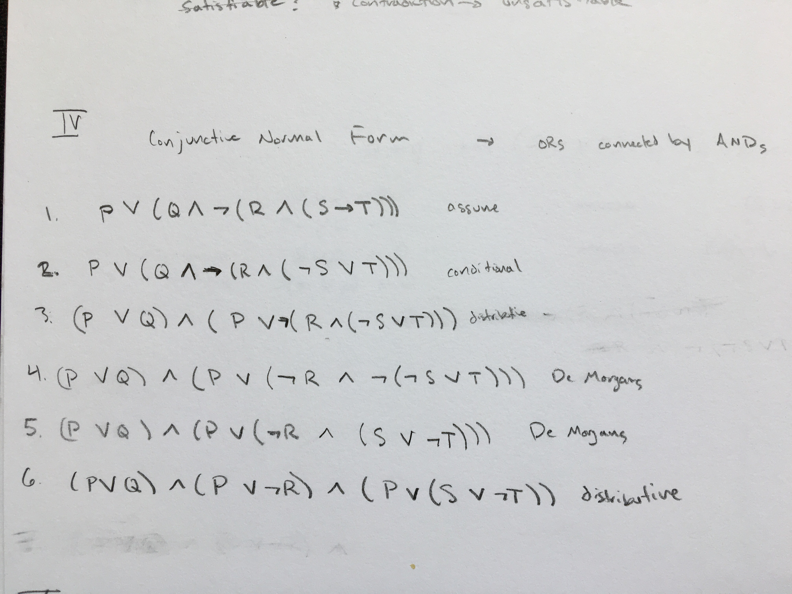

# FOCS Homework 11, for Day 12

```
Student Name: Keenan Zucker
Check one:
[X] I completed this assignment without assistance or external resources.
[ ] I completed this assignment with assistance from ___
   and/or using these external resources: ___
```

## I. Formal Proofs

Use the rules of inference from class (reprinted below) to construct formal, numbered proofs of the following:

### 1. 

Assuming _p -> q_ and _p -> r_, prove _p -> (q AND r)_

statement  | reason
-----------|------------
1. P --> Q | assume
2. P --> R | assume
3. Q AND R --> Q | Specialization
4. Q AND R --> R | Specialization
5. P --> (Q AND R) | 1,2,3,4, Transitivity and MP?


### 2.

Assuming _p -> (q OR r)_ and _p -> (q OR NOT r)_, prove _p -> q_

statement  | reason
-----------|------------
1. P --> Q OR R | assume
2. P --> Q OR NOT R | assume
3. P --> (Q OR R) AND (Q OR NOT R) | 1, 2 Conjunction
4. P --> Q OR (R AND NOT R) | 3, Distributive
5. P --> Q OR F | 4, Negation
6. P --> Q | 5, Identity


## II. Truth tables

Use a truth table to show the equivalence of the assumptions and conclusion from problem 1, above:  Assuming _p -> q_ and _p -> r_, prove _p -> (q AND r)_

[Style note:  what is the canonical order of the rows in a truth table for three propositions?]


 P  | Q   | R   | P --> Q | P --> R | P --> (Q AND R)
----|-----|-----|---------|---------|----
 0  |  0  |  0  |  1	  |		1	|	1
 1  |  0  |  0  |  0	  |		0	|   0
 0  |  1  |  0  |  1	  |		1	|	1
 0  |  0  |  1  |  1      |		1	|	1
 1  |  1  |  0  |  1	  |		0	|	0
 1  |  0  |  1  |  0	  |		1	|	0
 0  |  1  |  1  |  1	  |		1	|	1
 1  |  1  |  1  |  1      |		1	|	1

## III. Tautology, satisfiable, contradiction

Which of the following are tautologies?  Satisfiable?  Unsatisfiable (contradictions)?

### 1. _(p AND q AND r) -> (p OR q)_

Tautology?

### 2. _((p -> q) AND (q -> r)) -> (p -> r)_

Satisfiable

### 3. _(p -> q) -> p_

Satisfiable

### 4. _(p OR q OR r) AND ((NOT p) OR (NOT q) OR (NOT r)) AND (p OR (NOT q)) AND (q OR (NOT r)) AND (r OR (not p))_ 

Contradiction --> can never satisfy all of the possiblities


### 5. [** challenge/optional] _(p <=> (q OR r)) -> ((NOT q) -> (p AND r))_


## IV. CNF

Transform the following formula into conjunctive normal form.  Show your steps.

_p OR (q AND NOT (r AND (s -> t)))_




## V. Short certificate

Demonstrate that the formula in problem IV is satisfiable.  Explain whether you used a  "short certificate" or exhaustive enumeration to make this determination.


The formula is satisfiable if P is true since the left side of the OR is irrelevant if P is true. This is a short certificate I believe since we can find one instance of it being proven satisfiable instead of doing an exhaustive enumeration or truth table of all the possibilities. 


