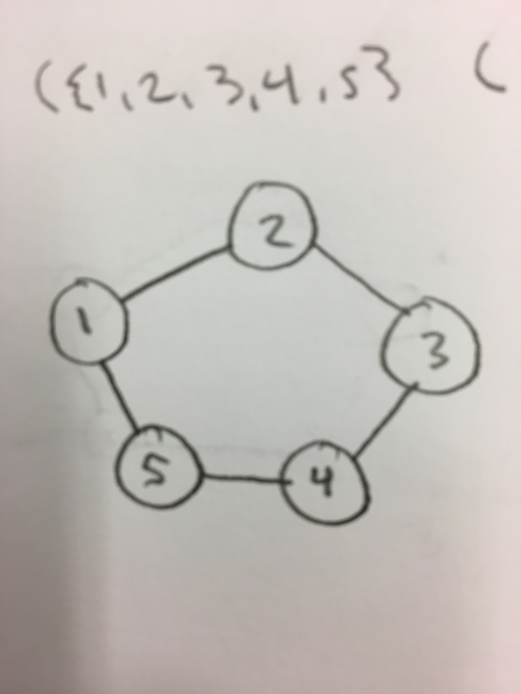

# FOCS Homework 16

```
Student Name: Keenan Zucker
Check one:
[X] I completed this assignment without assistance or external resources.
[ ] I completed this assignment with assistance from ___
   and/or using these external resources: ___
```

## I. (Undirected) Graphs

A **graph** is a set of points (called **nodes** or **vertices**), connected pair-wise by lines (called **edges**).

Formally, a graph is an ordered pair *G* = (*V*, *E*): *V* is a set of vertices; E is a set of edges; and an edge is a set of the nodes that are its ends.

*G* = ({1, 2, 3}, {{1, 2}, {1, 3}})

### 1. Match the diagrams to the graph structures.

(i) *G* = ({1, 2, 3, 4}, {{1, 2}, {1, 4}, {3, 4}})
##### B

(ii) *G* = ({1, 2, 3, 4}, {{1, 2}, {1, 4}, {2, 3}, {3, 4}})
##### A

(iii) *G* = ({1, 2, 3, 4, 5}, {{1, 2}, {1, 3}, {1, 4}, {1, 5}, {2, 5}})
##### D

(iv) *G* = ({1, 2, 3, 4}, {{1, 2}, {1, 4}, {1, 3}})
##### C

### 2. Cycles

Two vertices are **adjacent** if there's an edge between them.

A **cycle** is a sequence of adjacent vertices that begin and end with the same vertex.

Which of (1a-d) contains a cycle? For those graphs that contain a cycle, what is the cycle?

* A contains a cycle, which is vertices 1 -> 2 -> 3 -> 4 -> 1
* D contains a cycle, which is vertices 1 -> 2 -> 5 -> 1

### 3. Draw a diagram for this graph.

*G* = ({1, 2, 3, 4, 5}, {{1, 2}, {2, 3}, {3, 4}, {4, 5}, {1, 5}})



### 4. Write the graph (V, E) for this diagram.


This is a single graph. It is not a **connected graph**.

*G* =({1,2,3,4,5,6}, {{1,2}, {2,3}, {1,3}, {3,4}, {3,5}, {4,5}, {1,4}})

## II. Directed Graphs

A **directed graph** (“digraph”) is a set of vertices, together with arrows that begin and end on a vertex.

Formally, *G* = (*V*, *A*), where *A* is a set of tuples $(V_i, V_j)$.

### 5. Match the diagrams to the graphs.

(i) *G* = ({1, 2, 3, 4}, {(1, 2), (1, 4), (3, 2), (3, 4)})
##### A

(ii) *G* = ({1, 2, 3, 4}, {(1, 2), (1, 4), (4, 3)})
##### C

(iii) *G* = ({1, 2, 3, 4}, {(1, 2), (4, 1), (2, 3), (3, 4)})
##### B

### 6. Directed acyclic graphs

A cycle in a directed graph is a sequence of vertices, that starts and ends with the same vertex, where for each pair of consecutive vertices in the sequence there's an arrow from the first to the second.

A **directed acycle graph** (DAG) is a digraph that doesn't contain cycles.

Which of (5a-c) are DAGs?

*A **is** a directed acycle graph
*B **isn't** a directed acycle graph because of the cycle 1 -> 2 -> 3 -> 4 -> 1
*C **is** a directed acycle graph

### 7. Draw a diagram for this graph.

*G* = ({1, 2, 3, 4}, {(1, 2), (2, 3), (3, 4), (4, 1), (1, 3)})


Is this graph a DAG?

This group is not a DAG because of the cycle: 1 -> 2 -> 3 -> 4 -> 1

### 6. Write the graph (V, A) for this diagram.


*G* = ({1,2,3,4}, {(1,2), (2,4), (3,4), (3,2), (3,1)})

### 7. Adjacency matrices

An **adjacency matrix** is a square matrix *A* such that $A_{i,j}$ = 1 iff there is an arrow from vertex *i* to vertex *j*.

Write the adjacency matrix for the graph in (5a).
*G* = ({1, 2, 3, 4}, {(1, 2), (1, 4), (3, 2), (3, 4)})

```
 _ _ _ _ i
|0 0 0 0
|1 0 1 0
|0 0 0 0
|1 0 1 0
j

```

## III. (Optional) Reading

One of:

* Cormen *et al.* Section 6 “Graph Algorithms”, Chapters 22-24.
* Equivalent material in your favorite data structures text: graphs, Hamiltonian paths, algorithms to compute spanning trees, shortest paths.
* Wikipedia: [Graph](https://en.wikipedia.org/wiki/Graph_(discrete_mathematics)), [graph data type](https://en.wikipedia.org/wiki/Graph_(abstract_data_type)), [directed graph](https://en.wikipedia.org/wiki/Directed_graph), [adjacency matrix](https://en.wikipedia.org/wiki/Adjacency_matrix), [Hamiltonian path](https://en.wikipedia.org/wiki/Hamiltonian_path)

