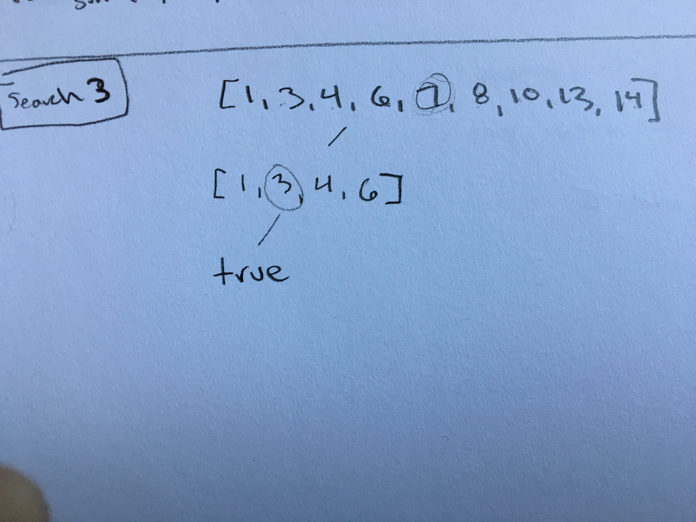

# FOCS Homework 19

```
Student Name: Keenan Zucker
Check one:
[ ] I completed this assignment without assistance or external resources.
[X] I completed this assignment with assistance from Byron
   and/or using these external resources: ___
```

## 0. [Not a question] Terminology

In class on Monday, we drew [**call graphs**](https://en.wikipedia.org/wiki/Call_graph) of the `fib` function, with and without memoization.

This particular kind of call graph is a **dynamic call graph**, whose nodes are function *invocations* during the execution of a program. The nodes of a **static call graph** are function *names*; arrows indicate appearances of a call in the program source text.

A dynamic call graph of a *recursive* function is also called a **recursion graph**.

## 1. Predicate Calculus – Models

Consider Table 1:

| x    | y    |
| ---- | ---- |
| a    | b    |
| b    | c    |
| a    | c    |
| c    | d    |
| d    | c    |
| c    | c    |
| b    | a    |

*Table 1*: A model for `loves(x, y)`

a. For each of the following, is Table 1 a model?  Explain briefly why or why not.

1. ∃x. ∀y. loves(x, y) -- NO -- There exists an X that loves all of the ys, this is not true since no letter loves all of the remaining three letters.
2. ∃y. ∀x. loves(x, y) -- YES .There exists a y which every x loves. The letter c is loved by all of the other letters.
3. ∀x. ∃y. loves(x, y) -- YES. Every x does love some y, which is true because every a,b,c,& d are listed as xs and have a corresponding y.
4. ∀y. ∃x. loves(x, y) -- YES -- For every y, there exists an x that loves it. This is true since every letter is represented in y.
5. ∃x. ∃y. loves(x, y) -- YES -- There exists an x that loves some y. This is true, obviously.
6. ∃x. ∀y. ¬loves(x, y) -- NO -- There exists an X that doesn't love all ys. This is not true because every letter loves at least one other letter.
7. ∃x. ¬∀y. loves(x, y) -- NO?-- There exists an x than loves no ys. This is not true because every letter loves at least one other letter.

b. Consider three models: (i) objects are a, b, c, d; `loves` is Table 1; (ii) objects are integers; `loves(x, y) ` ≝ x ≧ y; (iii) `loves(x, y)` ≝ x = y. In which of these models are these statements true:

| Statement                                | Table 1 | x ≧ y | x = y |
| ---------------------------------------- | ------- | ----- | ----- |
| ∀x, x. loves(x, x)                       |   F     |   T   |   T   |
| ∀x, y. loves(x, y) → loves(y, x)         |   F     |   F   |    T  |
| ∀x, y, z. loves(x, y) ∧ loves(y, z) → loves(x, z) |    F    |   T   |  T    |

c. (Optional) (Because we love graphs) Draw Table 1 as a digraph. What claims do each of the following make about a node x or y, in terms of its indegree and outdegree?

1. ∀x. loves(x, y)
2. ∀y. loves(x, y)
3. ∃x. loves(x, y)
4. ∃y. loves(x, y)

## 2. Predicate Calculus – Proofs

Given axioms:

1. ∀x. sum( x, 0, x )
2. ∀x, y, z. sum( x, y, z ) → sum( x, s(y), s(z) )
3. ∀x . product( x, 0, 0 )
4. ∀x, y, z, k. product( x, y, z ) ∧  sum( x, z, k ) → product( x, s(y), k )

Prove:

1.  ∃x. sum( x, x, s(s(0)) )

```
1. let x = s(0)
2. sum(x, 0, x) = sum(s(0), 0, s(0))                    axiom 1
3. sum(x, s(0), s(x)) = sum(s(0), s(0), s(s(0)))        axiom 2
4. sum(x, x, s(s(0)))                                   substitution, 1

```
2.  ∀x. sum( 0, x, x ) [hint:  induction]

```
1. Base case: sum(0,0,0)
2. sum(0,0,0) = sum(0, s(0), s(0))                     axiom 2
3. sum(0, s(0), s(0)) = sum(0, s(s(0)), s(s(0)))       axiom 2
4. sum(0, s(s(0)), s(s(0))) --> for all k: sum(0,k,k)
```

3.  [optional super-challenge] ∀x, y, z. sum( x, y, z ) → sum( y, x, z )

## 3. Maximum Subarray

The [maximum subarray problem](https://en.wikipedia.org/wiki/Maximum_subarray_problem) (*aka* maximum contiguous subsequence, *aka* maximum value contiguous subsequence) is “the task of finding the contiguous subarray within a one-dimensional array of numbers which has the largest sum. For example, for the sequence of values −2, 1, −3, 4, −1, 2, 1, −5, 4; the contiguous subarray with the largest sum is 4, −1, 2, 1, with sum 6” ([Wikipedia](https://en.wikipedia.org/wiki/)).

```python
# Source: wikipedia
def max_subarray(xs):
    max_ending_here = max_so_far = 0
    for x in xs:
        max_ending_here = max(0, max_ending_here + x)
        max_so_far = max(max_so_far, max_ending_here)
    return max_so_far
```

a. Draw a recursion graph of `max_subarray([−2, 1, −3, 4, −1, 2, 1, −5, 4])`.

This function is not recursive, so I'm not sure how to draw a recursive graph.

b. Is `max_subarray` an example of divide and conquer? Why or why not?

I don't think max_subarray is an example of divide and conquer since the definition of divide and conquer contains recursive calls, which this function does not contain.

c. Is `max_subarray` an example of dynamic programming? Why or why not?

I think this can be considered an example of dynamic programming because it breaks down the problem into subproblems of using a *max* function call. However, it does not use any memoization to store values.

d. Consider a *memoized* version of `max_subarray`. (You don't need to produce code for this. You do need to understand what memoization does to a call graph.) Draw the recursion graph for `memoized_max_subarray([−2, 1, −3, 4, −1, 2, 1, −5, 4])`.

The problem still will run in O(n) time because it is simply a for loop and runs through the array one time. Storing values using memoization will not help us.

e. [Optional challenge] Produce working code for memoized `max_subarray`.

## 4. Binary Search

```python
def binary_search_array_helper(x, xs, left, right):
    if left == right: return None
    middle = int((left + right) / 2)
    if x < xs[middle]:
        return binary_search_array_helper(x, xs, left, middle)
    elif xs[middle] < x:
        return binary_search_array_helper(x, xs, middle, right)
    else:
        return middle

def binary_search_array(x, xs):
    return binary_search_array_helper(x, xs, 0, len(xs))
```

a. Above is an implementation of the [binary search algorithm](https://en.wikipedia.org/wiki/Binary_search_algorithm). Draw the recursion graph for `binary_search_array(3, [1, 3, 4, 6, 7, 8, 10, 13, 14]))`.



b. Is `binary_search_array` an example of divide and conquer? Why or why not?

Yes, this is an example of divide and conquer since the array is getting split up with each search. Half of the array is getting thrown away each recursion call, meaning it is O(log n) time.

c. Is `binary_search_array` an example of dynamic programming? Why or why not?

No, I don't think this is dynamic programming because there is no memoization in this problem.

d. Consider a memoized version of `binary_binary_search_array_helper`. Draw the recursion graph for a function memoized `memoized_binary_search_array(3, [1, 3, 4, 6, 7, 8, 10, 13, 14]))` that calls `memoized_binary_search_array_helper`.

I don't know what you would memoize this problem, since you are throwing away half of the array each time. The comparison between values is a constant time operation.

e. Under what circumstances does the `memoized_binary_search_array` present any benefits over the unmemoized original? How does this relate to (i) its recursion graph; (ii) the key attributes of a dynamic program?

I would say never? I don't know why you would memoize this still so I'm an unsure.

f. [Optional challenge] Find the bug in `binary_search_array`. What input will cause it to fail? How can this be fixed? (Hint: it is a bug that appears for small arrays. Python is not susceptible to [this bug](https://research.googleblog.com/2006/06/extra-extra-read-all-about-it-nearly.html).)

## 5. Datalog Tutorial

Dust off your DrRacket, and follow the Datalog tutorial [here](https://docs.racket-lang.org/datalog/Tutorial.html).

## 6. SQL

Install [SQLite](https://www.sqlite.org):

* **Linux**: `sudo apt-get install sqlite`
* **macOS** (w/ [homebrew](http://brew.sh)): `brew install sqlite3`
* **Windows**; **macOS** (w/out homebrew): download the pre-compiled binary from the [SQLite Download Page](https://sqlite.org/download.html)

Kick its tires:

```
$ sqlite3
SQLite version 3.13.0 2016-05-18 10:57:30
Enter ".help" for usage hints.
Connected to a transient in-memory database.
Use ".open FILENAME" to reopen on a persistent database.
sqlite> create table course(title string, number string, area string, credits int);
sqlite> insert into course values ("FOCS", "ENGR3520", "ENGR", 4);
sqlite> insert into course values ("SoftDes", "ENGR2510", "ENGR", 4);
sqlite> insert into course values ("Discrete", "MTH2110", "MTH", 4);
sqlite> .mode column
sqlite> .headers on
sqlite> select * from course;
title       number      area        credits
----------  ----------  ----------  ----------
FOCS        ENGR3520    ENGR        4
SoftDes     ENGR2510    ENGR        4
Discrete    MTH2110     MTH         4
sqlite> select * from course where area="ENGR";
title       number      area        credits
----------  ----------  ----------  ----------
FOCS        ENGR3520    ENGR        4
SoftDes     ENGR2510    ENGR        4
sqlite> .quit
```

