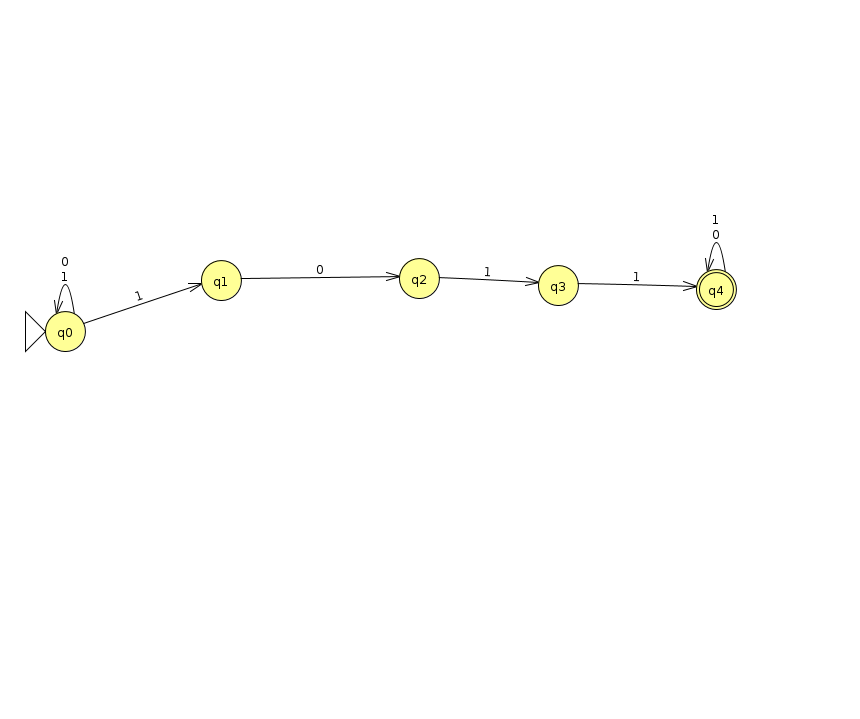
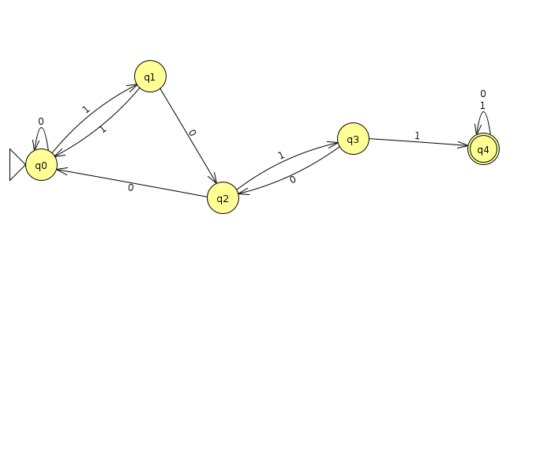

# FOCS Day 7 Homework Solutions
## Keenan Zucker

## Part 1: Finite Automata

### 1. Nondeterministic automaton

### 2. Conversion to deterministic automaton

State | 0 | 1
--- | --- | ---
q0 (start) | q0 | q1
q1 | q2 | q0
q2 | q0 | q3
q3 | q2 | q4
q4 (end) | q4 | q4

### 3. Larger alphabet

A machine that is 'a' through 'z' would not be more powerful. The machine might be more complex, but that doesn't mean it is more powerful.

Let's consider two machines, M1 that only accepts strings of the alphabet {0,1}, and M2 which accepts strings {a,b,c,d}. Each is a finate state machine, meaning that the input has a finite number of strings. 

Each character in M2 can also be represented in a binary way, that is, using 0s and 1s in a format like this: a--> 0, b --> 1, c --> 01, d--> 11. This could also be applied to an entire alphabet letters 'a' --> 'z'. 

Using this format, the two machines, M1 and M2, could both solve an input string, making them equally as powerful, although with different levels of building complexity.

### Part 2: Regular expressions

### 6. Regular Expression Practice

Construct a regular expression that matches *all* and *only* those strings that contain exactly one `1` (and any number of `0`s). For example, `1`, `0010`, `100`; but not `0` or `101`.

/(0*10*)/