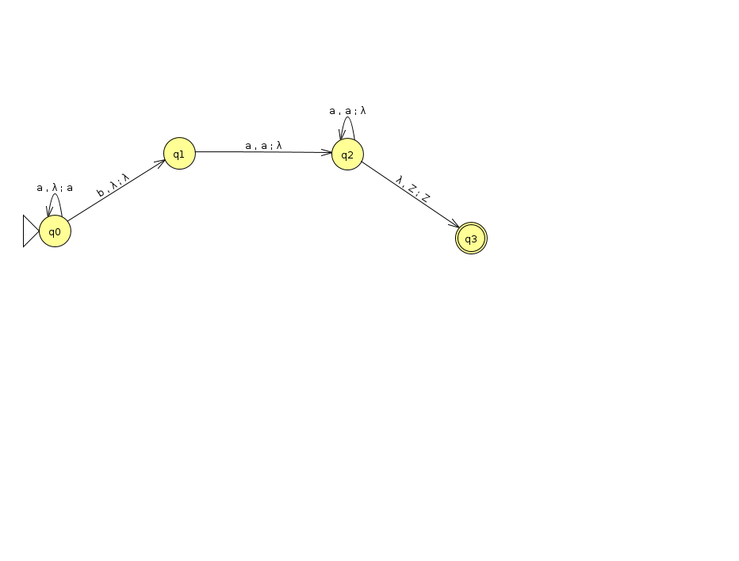

# FOCS Homework for Day 9

```
Student Name: Keenan Zucker
Check one:
[X] I completed this assignment without assistance or external resources.
[ ] I completed this assignment with assistance from ___
   and/or using these external resources: ___
```

#### 1. For each of the following languages, decide whether it is regular

a)  NOT REGULAR

input string is `aaaaaaaa` (a8), loop two of the middle a's to give `aaaaaaaaaa` (a10) which is not in the language

b)	REGULAR? unsure about this one

`/0*1*(01)*1*0/`

c) NOT REGULAR

If the input string is `00100100`, loop the middle `10` to get `00101000100` and the string is no longer the same substring reversed.

#### 2. The Pumping Game

a) Number 15: `L = {a^n b^n^2}`
	- Word I choose: `aaaabbbbbbbbbbbbbbbb`
	- Computer's pick: `aaaab(b)bbbbbbbbbbbbbb`
	- Successfully pumped string: `aaaab(bbbbbbbbbbbbbbbbbbbbb)bbbbbbbbbbbbbb`


b) Number 16: `L = {a^n b a^n}`
	- Word I choose: `aaaaabaaaaa`
	- Computers pick: `aaaaa(b)aaaaa`
	- Successfully pumped string: `aaaaa(bbbbbbbbb)aaaaa`

c) Number 18: `L={w∈Σ∗∣|w| is odd and the middle symbol is a}`
	- Word I choose: `bbbbbbbbbbabbbbbbbbbb`
	- Computers pick: `bbbbbbbbbbabbb(bb)bbbbb`
	- Successfully pumped string: `bbbbbbbbbbabbb(bbbbbbbbb)bbbbb`

#### 3. Create a PDA

Number 16: `L={a^n b a^n ∣ n ∈ N}`



