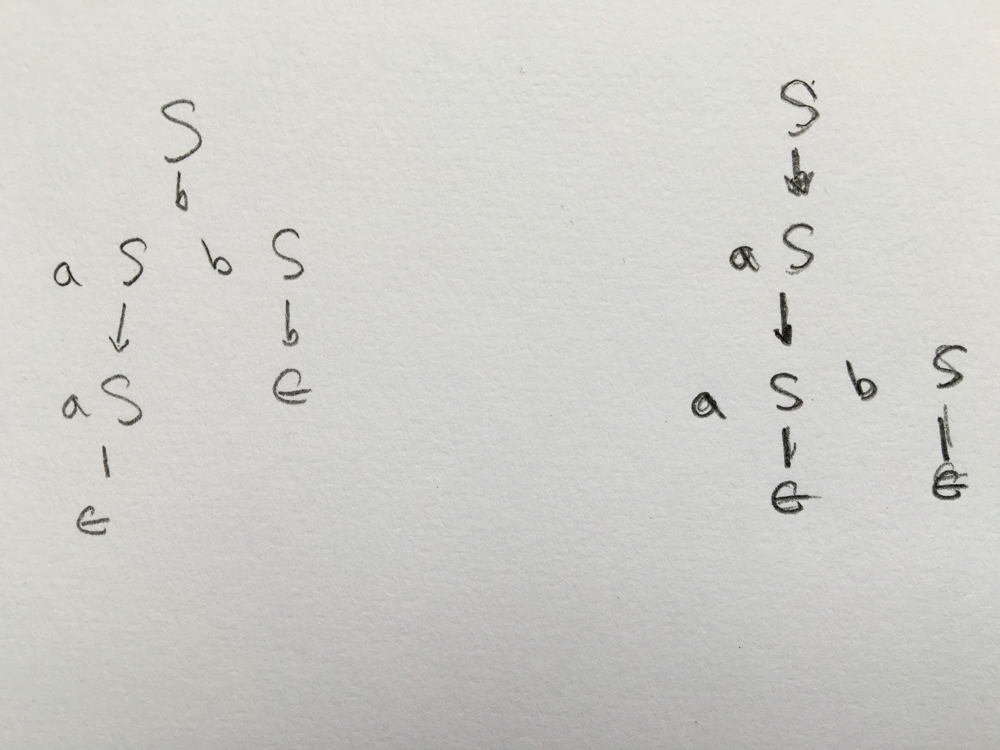

# FOCS Homework 9, for Day 10

```
Student Name: Keenan Zucker
Check one:
[X] I completed this assignment without assistance or external resources.
[ ] I completed this assignment with assistance from ___
   and/or using these external resources: ___
```

## 2. Constructing Grammars

a) All strings (over {0,1}) consisting of a substring _w_ followed by its reverse. (This is the same problem you were asked to work on in class.)

- `S --> aSa`
- `S --> bSb`
- `S --> e`

Give a derivation for `010010`.

`S --> aSa --> abSba --> abaSaba --> abaaba = 010010`

b) All strings (over {a,b,c}) of the form a^{i}b^{i}c^{j}: an equal number of `a`s and `b`s, followed by any number of `c`s. For example, `aabb`, `aabbcc`, and `aabbcccc`, but not `aaaabbcc`.

- `S --> S1 S2`
- `S1 --> a S1 b | e`
- `S2 --> S2 c | e`

c) All strings (over {a,b,c}) of the form a^{i}b^{j}c^{j}: any number of `a`s, followed by an equal number of `b`s and `c`s. For example, `abbcc`, `aabbcc`, and `aaaabbcc`, but not `aabbccc`.

- `S --> S1 S2`
- `S1 --> a S1  | e`
- `S2 --> b S2 c | e`

d) Give two distinct grammars that produce the strings described by the regular expression `(ab)*`: empty, `ab`, `abab`, `ababab`, ….

1. `S --> a b S | e`

2.  - `S --> a S1 | e`
	- `S1 --> b S`


## 4. Ambiguous Grammars

Consider the grammar:

    S --> a S | a S b S | epsilon

This grammar is ambiguous. Show in particular that the string `a a b` has
two:

a. parse trees


b. leftmost derivations (These are the ones that, starting from the start variable, rewrite the leftmost nonterminal first.)

1. `S --> a S b S --> a a S b S --> a a b S --> a a b`
2. `S --> a S --> a a S b S --> a a b S --> a a b`

c. rightmost derivations (These are the ones that, starting from the start variable, rewrite the rightmost nonterminal first.)

1. `S --> a S b S --> a S b --> a a S b --> a a b`
2. `S --> a S --> a a S b S --> a a S b --> a a b`